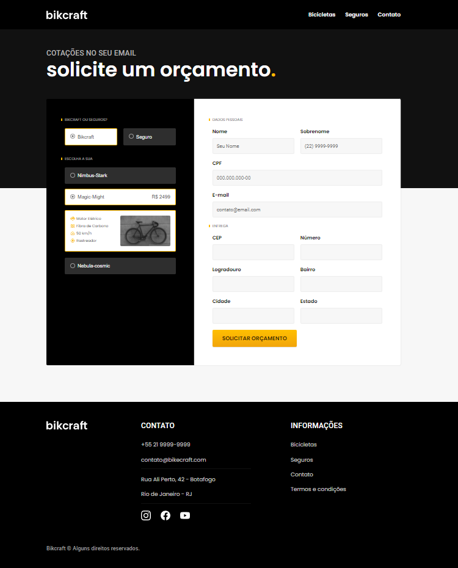
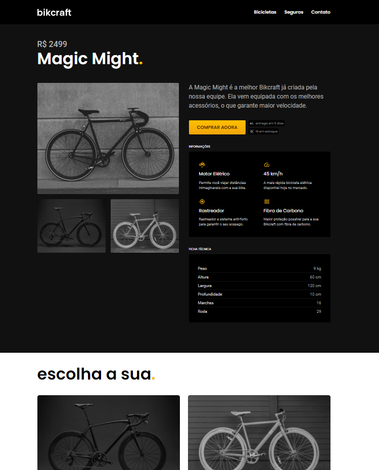

# <h1> 😃 Bikcraft</h1> 
Site de venda de bicicletas elétricas 🚲

     

## Sobre o projeto ⚡
Projeto final do curso HTML E CSS da plataforma [ORIGAMID](https://www.origamid.com/), criado utilizando HTML e CSS e suas funcionalidades:

 Semântica | Acessibilidade | Formulários  
 Posicionamento | Display | Box Model | Variaveis CSS | Animation | Media Queries | Grid | FlexBox  
 Também adicionado algumas funções com JavaScript.

## Acesse a página ✔️

https://pablohpaiva22.github.io/bikcraft/
